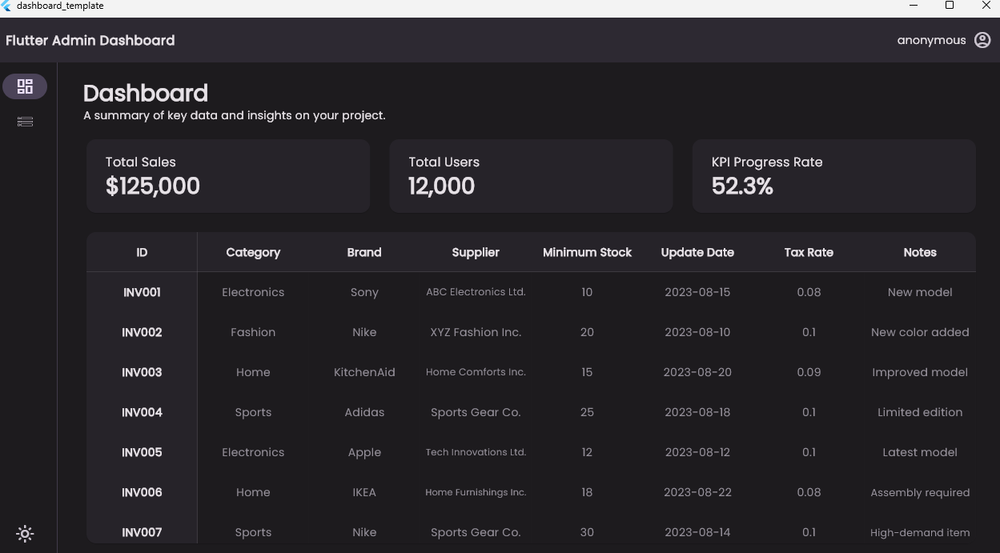

# Flutter admin仪表盘模板
<div style="display:flex;align-items: center; justify-content: space-aroud; height:100%;padding:10px;height:300px;">
    
    
    
</div>

## 特性
- 基于[adaptive_theme](https://pub.dev/packages/adaptive_theme)自适应, 支持移动端和PC端
- 支持暗夜模式
- 基于[dio](https://pub.dev/packages/dio)实现API拦截器，token失效自动跳转登录页
- 基于[go_router](https://pub.dev/packages/go_router)及go_router_builder实现便捷路由添加

## 项目结构
```
├─api                                      
├─layout                  
├─models                  
├─pages
├─router
└─widgets
```

## 参考
- [登录页](https://github.com/afgprogrammer/Flutter-Login-Page-UI)
- [仪表盘](https://github.com/htsuruo/flutter-admin-dashboard-template)